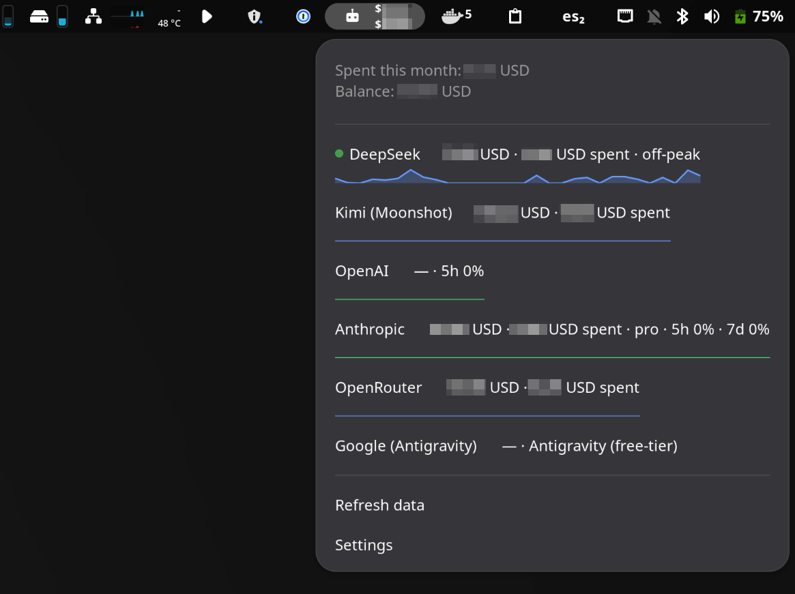

# aium

AI usage monitor: a Python CLI core that polls your AI providers and a GNOME
Shell extension that displays the results. Think of it as a system monitor, but
for AI providers.

[](https://pypi.org/project/aium-cli/)
[](https://github.com/jonykalavera/aium/actions)
[](LICENSE)

## Features

- **Panel indicator** — robot icon with monthly spend and balance (stacked two-line label).
- **Popover** — per-provider: balance, monthly spend, rate-limit **quota windows**,
  **sparklines** (spend or quota trend), plan, and a **peak/off-peak** dot for
  providers with dynamic pricing (DeepSeek).
- **Clickable providers** — open the provider's usage/dashboard page.
- **Provider abstraction** — add a provider with one file + one registry entry.
- **Secrets** — API keys in the system keyring; OAuth providers reuse the CLI's
  own credential files (Codex, Claude Code, Antigravity); Cursor reuses the
  signed-in IDE session.
- **History** — SQLite time-series of balances, quota and usage.
- **systemd timer** — polls every 60 minutes, no resident daemon.

## Screenshots



## Installation

### Quick install (CLI + timer + extension)

```bash
curl -fsSL https://raw.githubusercontent.com/jonykalavera/aium/main/install.sh | bash
```

Pin a specific release with `AIUM_VERSION`:

```bash
curl -fsSL https://raw.githubusercontent.com/jonykalavera/aium/main/install.sh | AIUM_VERSION=v0.1.1 bash
```

The script installs the `aium` CLI from PyPI (`aium-cli`), the systemd user
timer (polls every 60 min) and the GNOME Shell extension. Requires `curl`,
`unzip`, and one of `uv` / `pipx` / `pip`. Restart GNOME Shell (logout/login)
to load the extension.

### CLI only

```bash
pipx install aium-cli     # or: uv tool install aium-cli
aium init
```

The CLI reads its config from `~/.config/aium/` (YAML) and keeps history in
`~/.local/share/aium/` (SQLite).

### Extension only

Grab `aium@jonykalavera.zip` from the [releases](../../releases) page, extract it
to `~/.local/share/gnome-shell/extensions/aium@jonykalavera/`, compile the
schema (`glib-compile-schemas schemas`) and enable it with
`gnome-extensions enable aium@jonykalavera`.

### From source (development)

```bash
./local-install.sh         # installs the CLI (uv tool), the systemd timer and the extension from this repo
```

## Quick start

```bash
aium providers add deepseek
aium keys set deepseek                  # prompts for the API key (keyring)
aium poll
aium status
```

## Providers

| Kind | Auth | What it reports | Balance means |
|---|---|---|---|
| `deepseek` | API key | balance, peak/off-peak tariff | prepaid credit (`balance`) |
| `kimi` | API key | balance | prepaid credit (`balance`) |
| `openrouter` | API key | balance + monthly usage | prepaid credit (`credits`) |
| `openai` | OAuth (Codex) | rate-limit quota windows | none |
| `anthropic` | OAuth (Claude Code) | spend vs monthly limit + quota windows | monthly budget remaining (`budget`) |
| `google` | OAuth (Antigravity) | plan/tier + quota (paid tiers) | none |
| `cursor` | IDE session | included+on-demand spend; remaining included budget; quota windows | remaining included usage (`budget`) |
| `zai` | API key | quota windows + plan | none |
| `manual` | — | fixed subscription cost + renewal | — |

**Balance semantics.** "Balance" means different things per provider:
- **Prepaid credit** (`balance`/`credits`) — real money on the account. OpenRouter
  reports it as `credits` because BYOK/free usage is billed elsewhere and does
  not decrement it.
- **Budget** (`budget`) — remaining monthly spending limit (Anthropic extra
  usage, Cursor **included** usage), not money you hold. Cursor's
  `spend_this_month` is included usage consumed **plus** on-demand overage;
  that spend is not subtracted from the included-budget row.
- **None** — the provider exposes no balance (quota/plan only).

The aggregated **Prepaid balance** total sums only prepaid-credit balances;
budget and quota-only providers are shown per-row but excluded from the total.

OAuth providers reuse the CLI's own credential files (`~/.codex/auth.json`,
`~/.claude/.credentials.json`, `~/.gemini/oauth_creds.json`) — no API key
needed. Cursor reads the signed-in IDE session from
`~/.config/Cursor/User/globalStorage/state.vscdb` (or `cursor-agent`'s
`~/.config/cursor/auth.json`). Their usage endpoints are **private/undocumented**
and may break.

### Commands

```bash
aium providers add|list|show|update|remove
aium providers update deepseek --peak-window 00:30-16:30   # UTC high-tariff window
aium keys set|list|delete
aium poll                 # fetch every provider, persist history, refresh cache
aium status               # show the last cached status
aium history <id>         # balance history for a provider
aium stats                # braille sparkline dashboard (live, Ctrl+C to stop)
aium stats --once         # single frame
aium stats --provider deepseek --poll
```

`peak_window` marks the UTC **peak (high-tariff)** hours as `'HH:MM-HH:MM'`
(wrapping across midnight allowed); the provider row shows a peak/off-peak
indicator. DeepSeek defaults to `00:30-16:30`.

## Architecture

```
src/aium/            # Python core (config, secrets, history, polling, providers)
extension/           # GNOME Shell outlet (GJS) — reads ~/.cache/aium/status.json
  lib/               #   pure logic (unit-tested), no gi:// imports
  tests/             #   GJS unit tests (gjs -m extension/tests/run.js)
systemd/             # aium-poll timer/service (user units)
tests/               # pytest (core)
```

The extension is a **passive outlet**: no provider CRUD, no secrets. It renders
`~/.cache/aium/status.json`, whose schema (`models.py::StatusFile`) is the
contract between the core and the extension.

## Development

```bash
uv sync --all-groups --locked   # install dev deps
make uv.check                   # ruff lint + ty typecheck + format check
make uv.test                    # pytest --cov aium --blockage (network blocked)
make ext-test                   # GJS unit tests for the extension logic
```

Tools: `ruff` (lint/format), `ty` (type checker), `pytest` (coverage + network
blockage). Recipes use bare commands; prefix with `uv.` to run inside the uv
environment. To iterate on the extension on Wayland (no hot reload), use
`./scripts/dev-nested.sh` (requires `mutter-devkit`).

## License

MIT — see [LICENSE](LICENSE).
